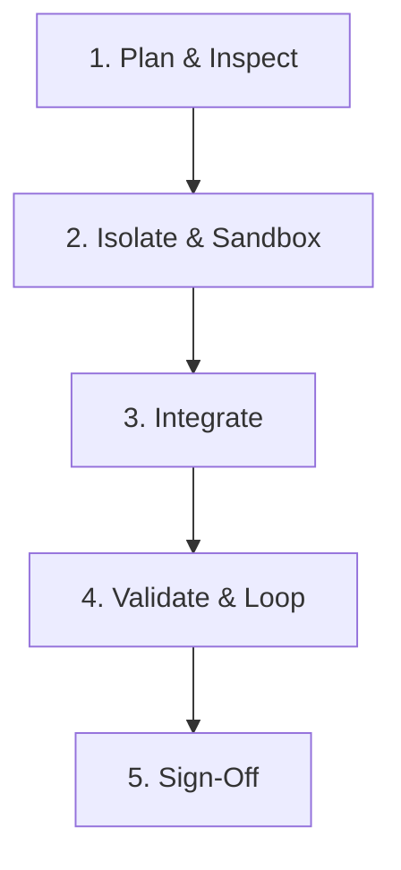

# Task Execution Lifecycle & Development Workflow

This document details the step-by-step lifecycle for handling any development task, ensuring maximum safety, code quality, and alignment with the existing architecture.

---

## 1. The Workflow Lifecycle

Every task must progress through these five distinct phases sequentially. Do not skip phases.

---

### Phase 1: Planning & Codebase Inspection
Before writing a single line of code, gather information and inspect the codebase.
*   **Inspect Existing Patterns:** Read files in the repository related to the task. Observe how dependencies are imported, how variables are named, and how errors are handled.
*   **Locate Configs:** Identify linter, formatter, type, and database configs to ensure any additions comply with existing compilation standards.
*   **Create the Action Plan:** Draft a mental model of the files to create, files to edit, and files to delete.

### Phase 2: Sandbox Isolation & Verification
Isolate risky or unfamiliar logic from the main application codebase.
*   **Create a Scratch Script:** Write a small script in `brain/scratch/` or a temporary test file.
*   **Verify Logic:** Run the script to verify that database calls, API requests, third-party libraries, or regex statements work as expected.
*   **Inspect Edge Cases:** Verify how the isolated code behaves under failure conditions (timeouts, missing fields, connection loss).

### Phase 3: Integration
Port the validated solution into the codebase.
*   **Targeted Edits:** Avoid broad file overwrites. Use targeted patches or line-specific modifications.
*   **No Placeholders:** Write full, final implementations. Do not leave `// TODO` or `/* implement later */` tags in the merged code.
*   **Documentation and Comments:** Write clean, descriptive JSDoc comments or inline explanations detailing *why* non-obvious logic was implemented.

### Phase 4: Validation Loop
Verify correctness and ensure that no regressions have been introduced.
*   **Run Build Command:** Execute `npm run build` or the project equivalent to test type checking and bundle sanity.
*   **Run Tests:** Execute unit and integration tests to ensure existing behaviors are unaffected.
*   **Run Linter:** Execute the code linter (e.g., `eslint`) and formatters (e.g., `prettier`) to ensure the code complies with repository styles.
*   **Correct and Iterate:** If any build, lint, or test failures occur, correct them in a targeted loop until all validations pass.

### Phase 5: Sign-Off & Verification
Conclude the task by reporting back.
*   **Review Diff:** Run a git diff check (or use IDE capabilities) to inspect your changes.
*   **List Achievements:** Clearly summarize the modifications made, listing files created or edited.
*   **Provide Verification Steps:** Write explicit verification steps so the user can test the execution on their end.
